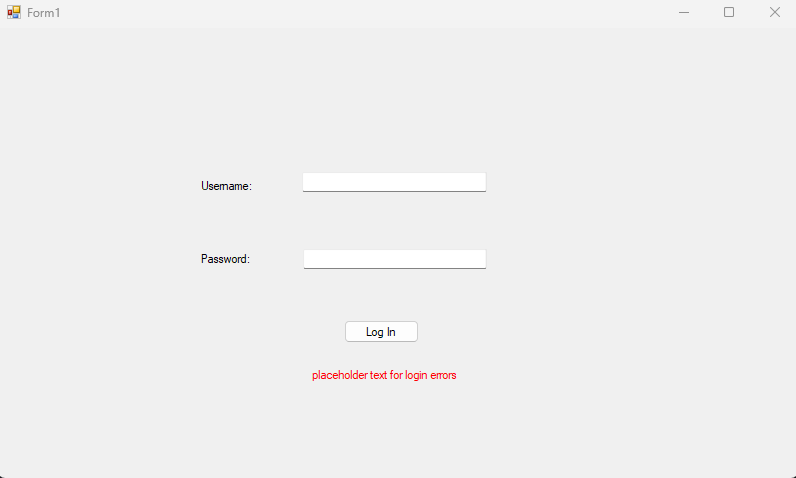
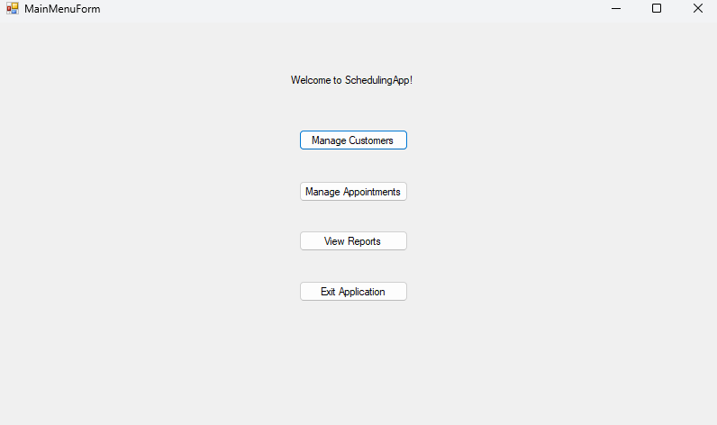
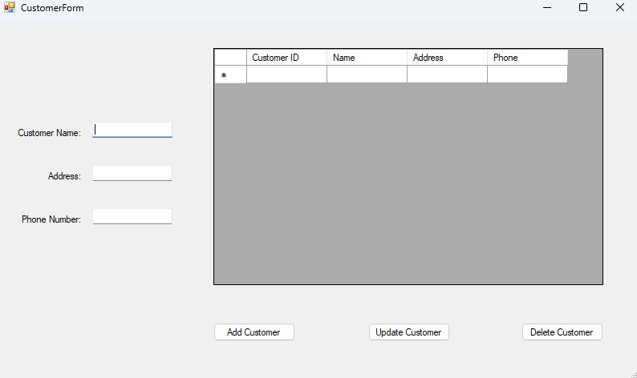
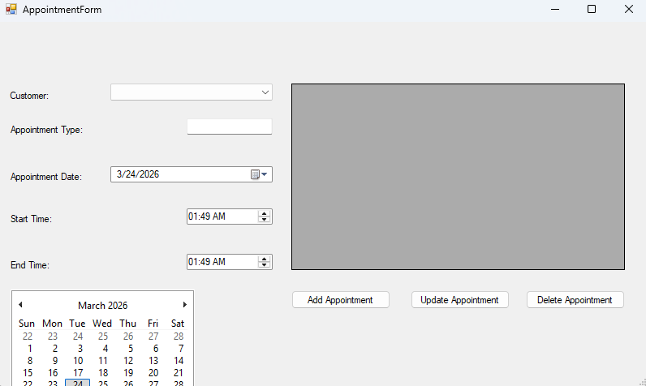
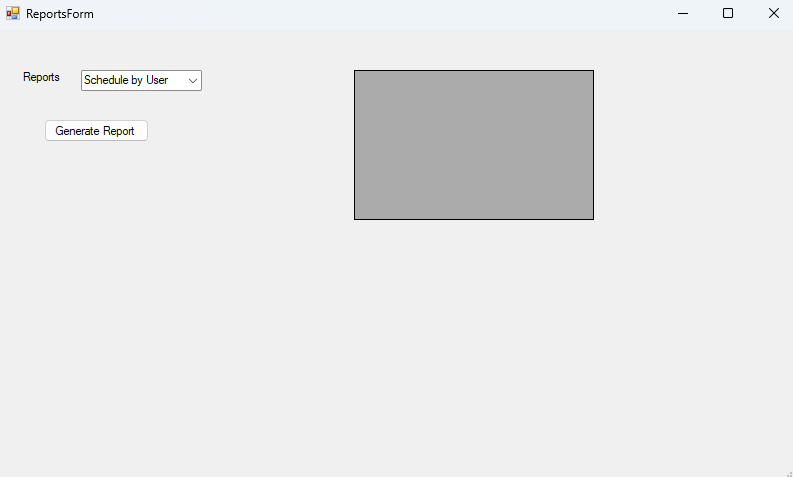

# SchedulingApp

## Overview
SchedulingApp is a C# Windows Forms desktop application developed as part of my Software Engineering degree. The application allows users to manage customers and appointments through a MySQL database while enforcing validation rules to prevent scheduling conflicts.

This project demonstrates working with databases, CRUD operations, validation logic, and building a structured desktop application.

## Features

### Authentication
• User login system  
• Login activity tracking  
• Validation of user credentials  

### Customer Management
• Add new customers  
• Update customer information  
• Delete customers  
• View customer records  

### Appointment Management
• Schedule appointments  
• Modify existing appointments  
• Delete appointments  
• Prevent overlapping appointments  
• Validate business hour requirements  

### Reports
• Appointment reports by month  
• Appointment reports by contact  
• Data displayed using DataGridView  

### Validation
• Prevent scheduling conflicts
• Prevent appointments outside business hours
• Input validation for required fields
• Error messages for invalid data

## Technologies Used

• C#
• .NET Windows Forms
• MySQL Database
• MySql.Data connector
• Visual Studio
• Object-oriented programming
• SQL queries

## Database Functionality

The application connects to a MySQL database to:

• Store customer records  
• Store appointment data  
• Retrieve appointment schedules  
• Update existing records  
• Delete records  

## Purpose

This project demonstrates:

• Database integration
• CRUD operations
• Desktop application design
• Input validation
• Working with SQL databases
• Applying object-oriented programming concepts

## How to Run

1 Clone the repository
2 Open the solution file in Visual Studio
3 Configure database connection settings
4 Run the application

(Note: Database connection details were removed for security.)

## Application Screenshots

### Authentication

### Main Navigation

### Customer Management

### Appointment Scheduling

### Reporting System

## Author
John Granat
Bachelor of Science - Software Engineering
